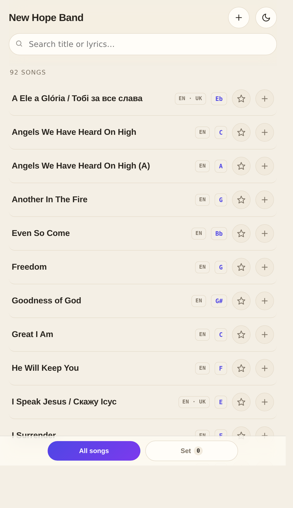
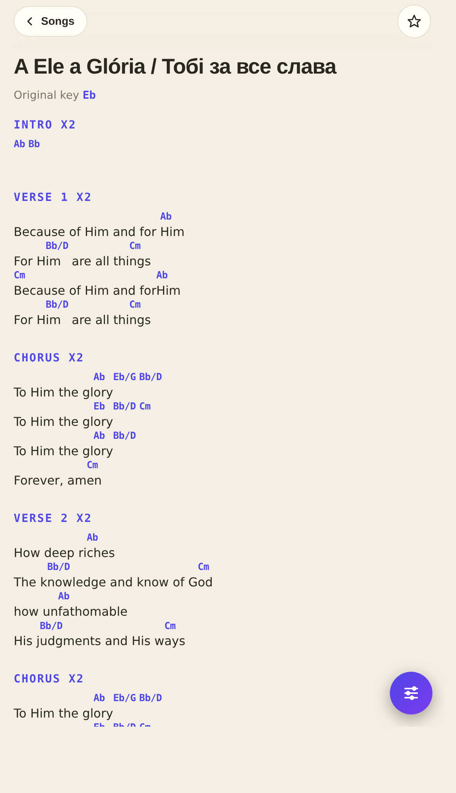
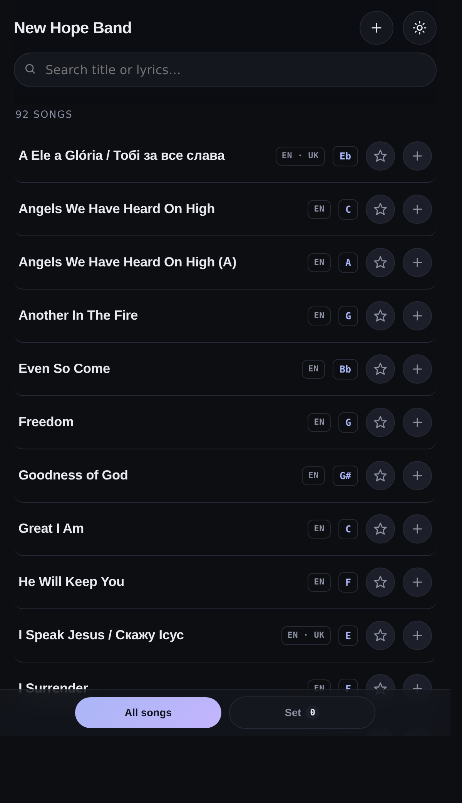

# 🎶 New Hope Band - Songbook

[](LICENSE)
[](https://avdey7.github.io/chn.songs/)
[](#-tech)
[](https://avdey7.github.io/chn.songs/)

A simple, beautiful worship **songbook** for our team. Lyrics + chords, live key
changes, guitar chord diagrams, set lists for each service, and a big easy
**stage mode** - all from one link, on **any phone, tablet, or computer**.
Works **offline** once opened. 🙌

**Live app → https://avdey7.github.io/chn.songs/**

<p align="center">
  
  
  
</p>

---

## 📲 Put it on your phone (1 minute)

It installs like a real app - no App Store needed.

**iPhone / iPad (Safari)**
1. Open the songbook link in **Safari**.
2. Tap the **Share** button (the square with the ↑ arrow).
3. Tap **Add to Home Screen** ➕ → **Add**.

**Android (Chrome)**
1. Open the link in **Chrome**.
2. Tap the **⋮** menu (top right).
3. Tap **Add to Home screen** / **Install app**.

Now there's an icon on your home screen. Open it once with internet and it keeps
working even **offline**. 🔌

---

## 🎵 Using the songbook

### Find a song
- 🔎 **Search** by title or any words in the lyrics. Tap the **✕** to clear it.
- 🏷️ Tap a **tag** chip (fast, communion, christmas…) to filter.
- ⭐ Tap the star on any row to **favorite** it, then use the **★ Favorites** filter.

### Open & read a song
Tap a song to open it. While reading:
- ⬅️➡️ **Swipe left/right** to jump to the next / previous song.
- 🎚️ Tap the **floating button** (bottom-right) to open the controls:

| Control | What it does |
|---|---|
| 🎼 **Key − / + / ↺** | Transpose up or down a semitone, or reset to the original key |
| 🔤 **Size − / + / ↺** | Make the text bigger or smaller (or **pinch** with two fingers) |
| 🎸 **Chords** | Show just lyrics, or lyrics **with chords** |
| ➕ **Set** | Add this song to your current set |
| ▶️ **Scroll** | Hands-free **auto-scroll** (− / + to change speed) |
| 🖨️ **Save PDF** | Print or save the song as a clean 2-column PDF |
| 🔳 **Stage** | **Stage mode**: huge text, pure-black screen, no clutter |

> 💡 The screen **stays awake** while a song is open, so it won't dim mid-song.

### 🌍 Two languages
Bilingual songs show **language tabs** (e.g. EN / UK) at the top of the controls.
Each language remembers its own key and transpose.

---

## 📋 Set lists (one per service)

Build the running order for a service and share it with the team.

- ➕ **Add to set:** tap the **+** on a song row, or **Set** inside an open song.
- 🔀 **Switch view:** **swipe** between **All songs** and **Set** (or tap the bottom tabs).
- ↕️ **Reorder:** in the **Set** tab, **press and hold a song** and drag it up or down
  (on a computer, drag the grip handle on the right).
- 🗂️ **Multiple sets:** use the toolbar to create / rename / delete sets (e.g. "Sunday AM").
- 📤 **Share:** tap **Share** to get a **link + QR code** - anyone who scans it gets the
  whole set. Use **Import** to load a set someone sent you.

---

## 🌗 Light & dark

Tap the ☀️ / 🌙 button (top right) to switch between the warm **light** theme and the
cool **dark** theme. **Stage mode** always goes full **black** for maximum contrast on
a music stand.

---

## ✍️ For admins (adding & editing songs)

Songs live in a shared online catalog, so an edit shows up for **everyone**.

- ➕ Tap the **＋** in the top bar to **add** a song, or **Edit** an open one.
- 🔑 Editing requires an **admin login** (ask Avdey to add your account).
- 🎹 Just type the section names (Verse, Chorus, Bridge, Приспів, Куплет…) on their own
  line and put chords in `[brackets]` - the app formats everything consistently and can
  even **save a transposed key** for the whole team.
- 🧰 The **converter** (`converter.html`) turns a normal "chords-above-lyrics" sheet into
  the right format automatically (including bilingual songs).

🛠️ **Full setup, hosting, and song-format details are in [`README.txt`](README.txt).**

## 🧰 Tech

- **Vanilla JS, no framework, no build step** - a static site you can open by double-clicking `index.html`.
- **PWA** - installable, offline-capable via a service worker (network-first app shell, cache-first assets).
- **[ChordSheetJS](https://github.com/martijnversluis/ChordSheetJS)** renders ChordPro; a small in-house converter turns "chords-above-lyrics" sheets into ChordPro.
- **Offline guitar chord diagrams** drawn as theme-aware SVG (no external assets).
- **[Supabase](https://supabase.com/)** hosts the shared song catalog (public read; authenticated admin writes via RLS).
- **GitHub Pages** hosts the app; **GitHub Actions** deploys on every push.

```bash
npm run check   # validate the JS (node --check on each file)
npm run serve   # serve locally at http://localhost:8000
```

---

<p align="center">
  Made with ♥ for the New Hope Band · by <b>Avdey Axonov</b> · <a href="LICENSE">MIT License</a>
</p>
